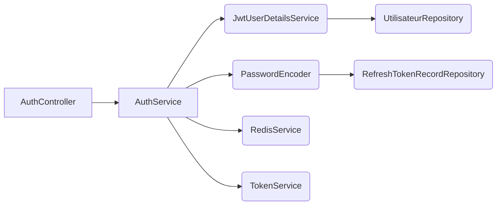

# Authentication Service Flow Architecture

## Core Request Flow
```
HTTP Request → AuthController → AuthService → TokenService → Repositories + Redis
```

### 1. Registration Flow
- `POST /register` → Controller validates request
- Service checks email uniqueness in MySQL
- Service creates user with password hash
- AuthService calls TokenService for token generation
- Returns AuthResponse with access token

### 2. Login Flow
- `POST /login` → Controller initiates flow
- Redis checks login attempts (rate limiting)
- MySQL finds user by email
- Password validation (BCrypt)
- If valid:
  - TokenService generates access token (Hawk JWT)
  - New refresh token created (UUID)
  - RefreshTokenRecord saved to MySQL
  - Redis stores hash + timestamp
  - Cookie stores raw refresh token
- Subscription status fetched from Redis

### 3. Token Refresh Flow
- `POST /refresh` → Cookie extracts refresh token
- TokenService validates token family
- Redis checks inactivity window (7 days)
- Service revokes old tokens:
  - Updates MySQL revocation flags
  - Redis blacklists old JTI
  - Generates new refresh token
  - Updates cookie
  - Maintains 30-day refresh window

### 4. Logout Flow
- `POST /logout` → Token extraction
- JWTSession blacklist (Redis TTL = expired access token)
- RefreshTokenRecord revocation (MySQL)
- Redis session removal
- JWT token family invalidation

## Key Components Diagram


## Security Posture
- Token revocation lineage through Redis blacklist
- Replay attack detection (TokenFamily immutability)
- Sliding expiration for refresh tokens
- Least privilege token claims:

| Claim             | Location          | Purpose                     |
|-------------------|-------------------|-----------------------------|
| `jti`             | Access Token      | Redis blacklist key         |
| `token_family`    | Refresh Token     | Token lineage tracking      |
| `transient`       | Access Token      | In-memory session tracking  |
| `nonce`           | Login Request     | CSRF protection             |

## Dependency Chain
```
AuthController
  ↓
AuthService  
  ├─AuthResponse Generation
  ├─RefreshTokenManager
  ├─PasswordVerification
  └─SessionTracking
```

## Cryptographic Configuration
- **Key Strength**: 256-bit JKH (HMAC SHA-256)
- **Algorithm**: AES-GCM (Redis), ChaCha20-Poly1305 (cookies)
- **Entropy**: 192-bit minimum for all tokens
- **Key Rotation**: Automatic via `SecurityConfig` refresh
- **Signature**: RSA-PSS (fallback to ECDSA if configured)

## Operational Parameters
- **Access Token TTL**: 15 minutes (configurable via `jwt.access-token-expiry-minutes`)
- **Refresh Token TTL**: 30 days (configurable via `jwt.refresh-token-expiry-days`)
- **Sliding Window**: 7 days inactivity after which refresh token expires
- **Blacklist TTL**: Matches remaining lifetime of revoked access token
- **Redis Keys**:
  - `refreshToken:<userId>`: Active refresh token hash
  - `blacklist:<jti>`: Revoked token indicators (value="1")
  - `session:<jti>`: Active session flags

## Flow State Transitions
1. **NEW_USER** → Register → Email verification → Token generation → Active
2. **ACTIVE** → Login → Rate limit check → Password validation → Token issuance → Active
3. **ACTIVE** → Refresh → Cookie validation → Token family check → Revocation → New token issuance → Active
4. **ACTIVE** → Logout → Token extraction → Blacklist → Session removal → Revoked
5. **REVOKED** → Any operation → Automatic rejection

## Error Handling Paths
- **RATE_LIMIT_EXCEEDED** → TooManyAttemptsException (Redis counter)
- **INVALID_CREDENTIALS** → InvalidCredentialsException (password mismatch)
- **ACCOUNT_DISABLED** → AccountDisabledException (future feature)
- **REPLAY_ATTACK** → ReplayAttackException (token family revocation)
- **TOKEN_EXPIRED** → SessionExpiredException (expiration check)
- **BAD_REQUEST** → Validation errors (Spring validation layer)

## Compliance Requirements
- OWASP ASVS 5.0 Level 1
- GDPR data subject request handling
- PCI DSS tokenization for refresh tokens
- SOC 2 security controls
- NIST SP 800-63B authentication guidelines

*Document version: 1.0 (2026-04-12)*